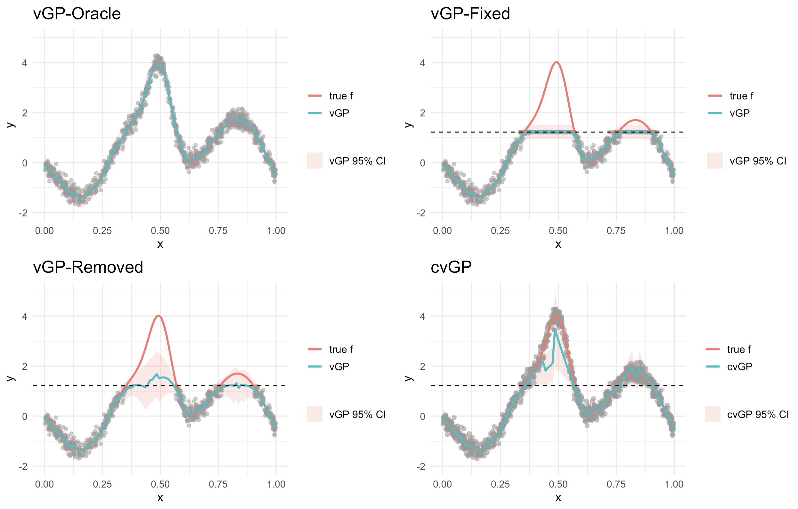

```{r setup, include=FALSE}
knitr::opts_chunk$set(
  collapse = TRUE,
  comment = "#>",
  message = FALSE,
  warning = FALSE,
  fig.align = "center",
  fig.path = "README_files/figure-gfm/",
  dpi = 150,
  fig.retina = 2,
  out.width = "100%"
)
```


## Introduction

The **censoredGP** repository provides R scripts for fitting Gaussian Process (GP) regression models with right-censored responses, with a particular focus on scalable computation for large datasets. Censored responses occur when the true latent response is only partially observed because it exceeds a known censoring threshold. Such data arise in many scientific applications, including engineering reliability, environmental monitoring, and biological experiments.

The proposed censoredGP fitting and prediction functions are implemented in `cenGP_fit_pred_functions.R`. The model combines:

- Gaussian Process regression
- likelihood-based treatment of right-censored responses
- Vecchia approximation for scalable computation with large datasets


This focuses on the following steps:

1. Simulating censored training and test data
2. Exploring the training data
3. Fitting the proposed censoredGP model 
4. Generating predictions for new inputs
5. Visualizing the predictions against the true function

The main functions used are:

- `simulate_1d_censored_data()`
- `simulate_borehole_censored_data()`
- `fit_censored_gp_nn()`
- `predict_censored_gp_nn_with_censoring()`

## Repository structure

This repository is not organized as a formal R package. Instead, the method is provided as standalone R and C++ scripts.

The main files are:

1. `cenGP_fit_pred_functions.R`: contains the proposed censoredGP fitting and prediction functions.
2. `cenGP_run_functions.R`: runs the Borehole 8-dimensional simulation study and evaluates prediction performance.
3. `VGP_fit_pred_functions_1d.R`: contains the functions used for the one-dimensional manuscript example.
4. `VGP_run_functions.R`: runs the one-dimensional example and produces the following main figure, comparing the standard GP model with the proposed censoredGP model.
5. `mc_sov_censored_nd.cpp`: contains the C++ implementation used for Monte Carlo simulation under censoring.
6. `mc_sov_cpp_usage.R`: provides an example of how to call the C++ functions from R.
7. `Naive_Approach.R`: implements the naive comparison approach.
8. `cvGP.Rmd`: contains the original detailed vignette-style analysis.

## Reproducing the main figure

To reproduce the one-dimensional manuscript plot, run:

```{r run-main-plot, eval=FALSE}
source("VGP_fit_pred_functions_1d.R")
source("VGP_run_functions.R")
```


```{r include-main-plot, echo=FALSE, out.width="100%", fig.align="center", fig.cap="Comparison of censored GP methods"}

```

## Load functions

```{r load-functions}
library(ggplot2)

source_file <- "cenGP_fit_pred_functions.R"
if (!file.exists(source_file)) {
  stop("Cannot find `cenGP_fit_pred_functions.R`. Please run this README from the root folder of the censoredGP repository.")
}
source(source_file)
```

## Simulate one-dimensional censored data

We first generate a one-dimensional simulated dataset using `simulate_1d_censored_data()`. The function produces `n = 800` total observations. Each input location is replicated between 1 and 3 times, and Gaussian noise with standard deviation `sigma = 0.2` is added to the true function values. A fixed censoring threshold `C = 1.221277` is applied, meaning any observation exceeding this value is recorded at the censoring threshold.

```{r simulate-data}
sim <- simulate_1d_censored_data(
  n = 800,
  split_method = "id",
  n_test_grid = 100,
  threshold_C = 1.221277,
  seed = 2024,
  seed_split = 2024,
  noise_sd = 0.2,
  reps_min = 1,
  reps_max = 3
)

train_data <- sim$train_data
test_data <- sim$test_data
C <- sim$threshold_C
f <- default_1d_fun

test_data <- make_1d_test_grid(
  n_test = 100,
  threshold_C = C,
  f = f
)
```

The simulated training data contains both the raw noisy response and the censored observed response:

- `x1`: input location
- `y`: raw noisy response before censoring, available because this is simulated data
- `y_censored`: observed response after right-censoring
- `censored`: censoring indicator, where `1` means the row is censored
- `ID`: replicate group ID

For fitting the censored model, we use the observed censored response as `y`. The raw noisy value is kept in `y_raw` only for diagnostics and plotting.

```{r prepare-fitting-data}
train_fit <- train_data
train_fit$y_raw <- train_fit$y
train_fit$y <- train_fit$y_censored

head(train_fit)
table(train_fit$censored)
```

## Explore the training data

Before fitting the model, it is useful to visualize the training data and understand how censoring affects the observed responses. The true underlying function used to generate the data is:

```{r define-true-function}
f <- function(x) {
  sin(2 * (7 * x - 2)) +
    3 * exp(-15^2 * (x - 0.5)^2) +
    sin(2 * (2 * x - 0.5))
}
```

```{r training-data-plot, fig.width=7.5, fig.height=4.5}
train_plot <- train_fit
train_plot$censor_status <- factor(
  train_plot$censored,
  levels = c(0, 1),
  labels = c("observed", "censored")
)

p0 <- ggplot(train_plot, aes(x = x1)) +
  geom_point(
    aes(y = y_raw, color = censor_status, shape = censor_status),
    alpha = 0.65,
    size = 1.8
  ) +
  geom_line(aes(y = f(x1), color = "true f"), linewidth = 1) +
  geom_hline(yintercept = C, linetype = "dashed") +
  labs(
    title = "One-Dimensional Censored Training Data",
    subtitle = sprintf("C = %.3f", C),
    x = "x",
    y = "y",
    color = NULL,
    shape = NULL
  ) +
  scale_color_manual(
    values = c(
      observed = "#1f77b4",
      censored = "#D55E00",
      "true f" = "black"
    )
  ) +
  scale_shape_manual(values = c(observed = 16, censored = 17)) +
  theme_minimal(base_size = 13)

print(p0)
```

The plot illustrates three key features of the simulated data:

- The noisy observations scatter around the true latent function shown by the black curve.
- Observations above the censoring threshold are recorded at the threshold.
- The censored observations appear at the dashed horizontal line, indicating that their exact latent values are not observed.

## Fit the censoredGP model

Choose the probability approximation method used for the censored likelihood. The default example uses sequentially ordered variable simulation:

```{r censor-method}
censor_method <- "sov"
```

Other available options include:

```{r censor-method-options, eval=FALSE}
censor_method <- "mc-sov"
censor_method <- "miwa"
censor_method <- "genzbretz"
censor_method <- "met"
```

We estimate the model parameters by maximizing the censored likelihood using `fit_censored_gp_nn()`.

```{r fit-model}
fit <- fit_censored_gp_nn(
  train_data = train_fit,
  x_cols = "x1",
  threshold_C = C,
  y_col = "y",
  censored_col = "censored",
  id_col = "ID",
  k = 20,
  init_params = c(
    tau_sq = 0.3462413,
    ell_x1 = 1.5,
    sigma_sq = 0.02911056,
    beta_Intercept = 0.01410213
  ),
  lower_bounds = c(
    tau_sq = 1e-6,
    ell_x1 = 1e-6,
    sigma_sq = 1e-6,
    beta_Intercept = -Inf
  ),
  upper_bounds = c(
    tau_sq = Inf,
    ell_x1 = Inf,
    sigma_sq = Inf,
    beta_Intercept = Inf
  ),
  censor_method = censor_method,
  use_parallel = TRUE,
  optim_control = list(maxit = 200),
  return_prepared = TRUE
)
```

The key arguments are:

- `train_data`: the training dataset containing censored and uncensored observations.
- `threshold_C`: the right-censoring threshold.
- `x_cols`: the input columns used in the GP covariance function.
- `init_params`: initial values for the hyperparameters.
- `k`: the number of nearest neighbors used in the Vecchia approximation.
- `censor_method`: the method used to approximate the censored likelihood contribution.

The estimated parameters and timing information are stored in the fitted object:

```{r inspect-fit}
fit$estimated_params
fit$final_log_likelihood
fit$optim_time
fit$total_seconds
fit$used_parallel
```

The estimated parameters are:

- `tau_sq`: signal variance, controlling the latent GP variability.
- `ell_x1`: length-scale, controlling the smoothness of the GP over the input space.
- `sigma_sq`: noise variance, accounting for measurement error.
- `beta_Intercept`: intercept in the mean function.

## Prediction

We generate predictions using `predict_censored_gp_nn_with_censoring()`. This prediction function conditions on nearby uncensored and censored training IDs and uses truncated-normal moments for censored neighbors.

```{r prediction}
pred <- predict_censored_gp_nn_with_censoring(
  fit = fit,
  test_data = test_data,
  k = 20,
  max_censored_ids = 5,
  min_uncensored_ids = 15,
  distance_method = "correlation",
  moment_method = "auto",
  predict_y = TRUE,
  interval_level = 0.95,
  unique_test_inputs = TRUE,
  verbose = FALSE
)

head(pred$merged_df)
```

The key prediction arguments are:

- `test_data`: the new inputs where predictions are required.
- `fit`: the fitted censoredGP model object.
- `k`: the maximum number of neighboring training IDs used for prediction.
- `max_censored_ids`: the maximum number of censored neighboring IDs used for moment adjustment.
- `min_uncensored_ids`: the minimum number of uncensored neighboring IDs required before applying the default prediction rule.
- `distance_method = "correlation"`: ranks neighbors by GP-implied correlation.
- `interval_level = 0.95`: produces 95% prediction intervals.

## Visualize predictions

To assess predictive performance, we compare the posterior predictive mean and 95% prediction interval with the true latent function.

```{r prediction-plot, fig.width=7.5, fig.height=4.5}
cGP <- pred$merged_df
cGP$true_f <- f(cGP$x1)

p1 <- ggplot(cGP, aes(x = x1)) +
  geom_ribbon(
    aes(ymin = CI_lower, ymax = CI_upper, fill = "censoredGP 95% PI"),
    alpha = 0.18
  ) +
  geom_point(
    data = train_fit,
    aes(x = x1, y = y_raw),
    color = "grey60",
    alpha = 0.6,
    size = 1.8,
    inherit.aes = FALSE
  ) +
  geom_line(aes(y = f(x1), color = "true f"), linewidth = 1) +
  geom_line(aes(y = mean_pred, color = "censoredGP"), linewidth = 1) +
  geom_hline(yintercept = C, linetype = "dashed") +
  labs(
    title = "Prediction from the proposed censoredGP model",
    subtitle = sprintf("C = %.3f", C),
    x = "x",
    y = "y",
    color = NULL,
    fill = NULL
  ) +
  scale_color_manual(
    values = c(
      "true f" = "#F8766D",
      "censoredGP" = "#00BFC4"
    ),
    breaks = c("true f", "censoredGP")
  ) +
  scale_fill_manual(values = c("censoredGP 95% PI" = "#F8766D33")) +
  guides(
    color = guide_legend(order = 1),
    fill = guide_legend(order = 2)
  ) +
  theme_minimal(base_size = 13)

print(p1)
```

## Simple prediction without censored-neighbor moment adjustment

For comparison, we also consider a simpler prediction method that uses only uncensored training rows.

```{r simple-prediction}
pred_simple <- predict_censored_gp_nn(
  fit = fit,
  test_data = test_data,
  max_marker_neighbors = 20,
  interval_level = 0.95,
  include_noise = TRUE
)

head(pred_simple)
```

```{r simple-prediction-plot, fig.width=7.5, fig.height=4.5}
simple_df <- test_data
simple_df$predicted_mean <- pred_simple$predicted_mean
simple_df$CI_lower <- pred_simple$CI_lower
simple_df$CI_upper <- pred_simple$CI_upper
simple_df$true_f <- f(simple_df$x1)

p2 <- ggplot(simple_df, aes(x = x1)) +
  geom_ribbon(
    aes(ymin = CI_lower, ymax = CI_upper, fill = "95% PI"),
    alpha = 0.18
  ) +
  geom_point(
    data = train_fit,
    aes(x = x1, y = y_raw),
    color = "grey60",
    alpha = 0.45,
    size = 1.4,
    inherit.aes = FALSE
  ) +
  geom_line(aes(y = true_f, color = "true f"), linewidth = 1) +
  geom_line(aes(y = predicted_mean, color = "simple predictor"), linewidth = 1) +
  geom_hline(yintercept = C, linetype = "dashed") +
  labs(
    title = "Prediction using uncensored neighbors only",
    subtitle = sprintf("C = %.3f", C),
    x = "x",
    y = "y",
    color = NULL,
    fill = NULL
  ) +
  theme_minimal(base_size = 13)

print(p2)
```

## Borehole 8-dimensional simulation

The Borehole simulation can be run from the repository root using:

```{r borehole-simulation, eval=FALSE}
source("cenGP_fit_pred_functions.R")
source("cenGP_run_functions.R")
```

This script applies the proposed censoredGP method to an 8-dimensional Borehole example and evaluates prediction performance. Because this simulation is larger than the one-dimensional illustration, it is not run automatically when knitting the README.


